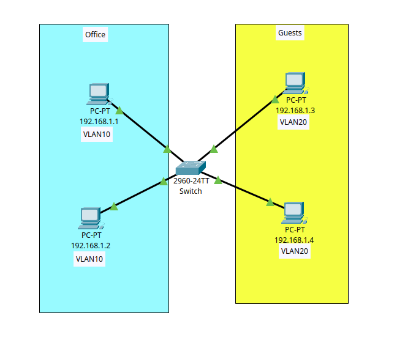

# 01. VLAN Configuration on a Cisco Switch (Packet Tracer)

This project demonstrates secure LAN segmentation on a Cisco switch using Virtual Local Area Networks (**VLANs**). Instead of using the default and insecure VLAN 1, the network has been divided into two independent VLANs: **VLAN 10 (Office)** and **VLAN 20 (Guests)**.

---

## 📐 Network Topology

Below is the visual network topology diagram showing the connections between the PCs and the switch, created in Cisco Packet Tracer:



### Addressing and Port Assignment Table:

| Device | Switch Port | Department / Purpose | VLAN | IP Address | Subnet Mask |
| :--- | :--- | :--- | :---: | :--- | :--- |
| **PC0** | FastEthernet 0/1 | Office | **10** | `192.168.1.1` | `255.255.255.0` |
| **PC1** | FastEthernet 0/2 | Office | **10** | `192.168.1.2` | `255.255.255.0` |
| **PC2** | FastEthernet 0/3 | Guests | **20** | `192.168.1.3` | `255.255.255.0` |
| **PC3** | FastEthernet 0/4 | Guests | **20** | `192.168.1.4` | `255.255.255.0` |

---

## 🛠️ Configuration Guide (CLI Script)

To replicate this configuration, log into the switch's Command Line Interface (**CLI**) and execute the following commands:

### Creating and Configuring VLAN 10 and VLAN 20
```text
enable
configure terminal

vlan 10
name Office
exit

interface range fastEthernet 0/1 - 2
switchport mode access
switchport access vlan 10
no shutdown
exit

vlan 20
name Guests
exit

interface range fastEthernet 0/3 - 4
switchport mode access
switchport access vlan 20
no shutdown
exit
```
### 💾 Saving the Configuration
After separating the devices into different VLANs, save the data permanently to non-volatile memory (NVRAM) with this command:
```text
do write memory
```

