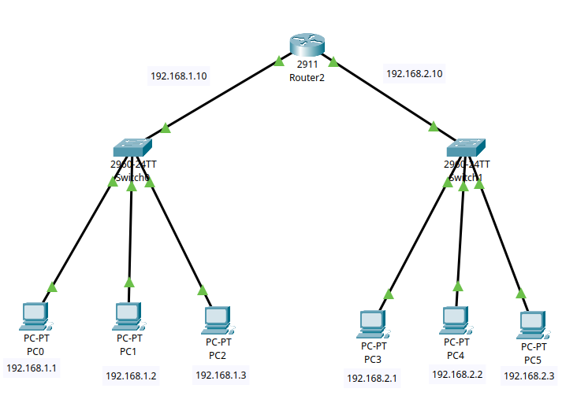
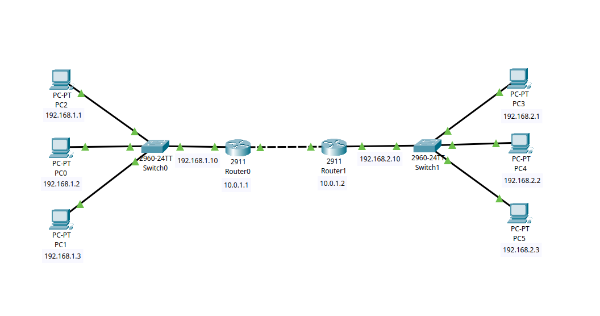

# 01. VLAN Configuration on a Cisco Switch (Packet Tracer)

This project demonstrates secure LAN segmentation on a Cisco switch using Virtual Local Area Networks (**VLANs**). Instead of using the default and insecure VLAN 1, the network has been divided into two independent VLANs: **VLAN 10 (Office)** and **VLAN 20 (Guests)**.

---

## 📐 Network Topology

Below is the visual network topology diagram showing the connections between the PCs and the switch, created in Cisco Packet Tracer:


### Addressing and Port Assignment Table:

| Device | Switch Port | Department / Purpose | VLAN | IP Address | Subnet Mask |
| :--- | :--- | :--- | :---: | :--- | :--- |
| **PC0** | FastEthernet 0/1 | Office | **10** | `192.168.1.1` | `255.255.255.0` |
| **PC1** | FastEthernet 0/2 | Office | **10** | `192.168.1.2` | `255.255.255.0` |
| **PC2** | FastEthernet 0/3 | Guests | **20** | `192.168.1.3` | `255.255.255.0` |
| **PC3** | FastEthernet 0/4 | Guests | **20** | `192.168.1.4` | `255.255.255.0` |

---

## 🛠️ Configuration Guide (CLI Script)

To replicate this configuration, log into the switch's Command Line Interface (**CLI**) and execute the following commands:

### Creating and Configuring VLAN 10 and VLAN 20
```text
enable
configure terminal

vlan 10
name Office
exit

interface range fastEthernet 0/1 - 2
switchport mode access
switchport access vlan 10
no shutdown
exit

vlan 20
name Guests
exit

interface range fastEthernet 0/3 - 4
switchport mode access
switchport access vlan 20
no shutdown
exit
```
### 💾 Saving the Configuration
After separating the devices into different VLANs, save the data permanently to non-volatile memory (NVRAM) with this command:
```text
do write memory
```

# 02. Basic Inter-Subnet Routing via Cisco Router (Packet Tracer)

This project demonstrates how to connect two separate Local Area Networks (LANs) using a Cisco Router as a Default Gateway. The network is divided into two distinct subnets: `192.168.1.0/24` (left side) and `192.168.2.0/24` (right side), allowing secure and controlled communication between different network segments.

---

## 📐 Network Topology

Below is the visual network topology diagram showing how the PCs, switches, and the router are interconnected in Cisco Packet Tracer:



### Addressing and Port Assignment Table:

| Device | Connected To | Interface / Port | IP Address | Subnet Mask | Default Gateway |
| :--- | :--- | :--- | :--- | :--- | :--- |
| **Router2** | Switch0 (Left) | GigabitEthernet 0/0 | `192.168.1.10` | `255.255.255.0` | *N/A* |
| **Router2** | Switch1 (Right) | GigabitEthernet 0/1 | `192.168.2.10` | `255.255.255.0` | *N/A* |
| **PC0** | Switch0 | FastEthernet 0/1 | `192.168.1.1` | `255.255.255.0` | `192.168.1.10` |
| **PC1** | Switch0 | FastEthernet 0/2 | `192.168.1.2` | `255.255.255.0` | `192.168.1.10` |
| **PC2** | Switch0 | FastEthernet 0/3 | `192.168.1.3` | `255.255.255.0` | `192.168.1.10` |
| **PC3** | Switch1 | FastEthernet 0/1 | `192.168.2.1` | `255.255.255.0` | `192.168.2.10` |
| **PC4** | Switch1 | FastEthernet 0/2 | `192.168.2.2` | `255.255.255.0` | `192.168.2.10` |
| **PC5** | Switch1 | FastEthernet 0/3 | `192.168.2.3` | `255.255.255.0` | `192.168.2.10` |

---

## 🛠️ Configuration Guide (CLI Script)

To replicate this configuration, log into the **Router2** Command Line Interface (**CLI**) and execute the following commands to assign IP addresses and activate the interfaces:

### Router Configuration
```text
enable
configure terminal

! Configure the Left Subnet Gateway (Switch0 side)
interface GigabitEthernet0/0
 ip address 192.168.1.10 255.255.255.0
 no shutdown
 do write memory
exit

! Configure the Right Subnet Gateway (Switch1 side)
interface GigabitEthernet0/1
 ip address 192.168.2.10 255.255.255.0
 no shutdown
 do write memory
exit

end
```

# 03. Static Routing Configuration Between Two Cisco Routers (Packet Tracer)

This project demonstrates how to connect two separate Local Area Networks (LANs) across a point-to-point Wide Area Network (WAN) link using two Cisco Routers and Static Routing. The network is segmented into three distinct subnets: 192.168.1.0/24 (left LAN), 10.0.1.0/24 (transit WAN link), and 192.168.2.0/24 (right LAN), enabling secure and explicit routing boundaries between different network branches.

## 📐 Network Topology

Below is the visual network topology diagram showing how the PCs, switches, and routers are interconnected in Cisco Packet Tracer:



Addressing and Port Assignment Table:

| Device | Connected To | Interface / Port | IP Address | Subnet Mask | Default Gateway |
| :--- | :--- | :--- | :--- | :--- | :--- |
| **Router0** | Switch0 (Left LAN) | GigabitEthernet 0/0 | `192.168.1.10` | `255.255.255.0` | *N/A* |
| **Router0** | Router1 (WAN Interconnect) | GigabitEthernet 0/1 | `10.0.1.1` | `255.255.255.0` | *N/A* |
| **Router1** | Router0 (WAN Interconnect) | GigabitEthernet 0/1 | `10.0.1.2` | `255.255.255.0` | *N/A* |
| **Router1** | Switch1 (Right LAN) | GigabitEthernet 0/0 | `192.168.2.10` | `255.255.255.0` | *N/A* |
| **PC2** | Switch0 | FastEthernet 0/1 | `192.168.1.1` | `255.255.255.0` | `192.168.1.10` |
| **PC0** | Switch0 | FastEthernet 0/2 | `192.168.1.2` | `255.255.255.0` | `192.168.1.10` |
| **PC1** | Switch0 | FastEthernet 0/3 | `192.168.1.3` | `255.255.255.0` | `192.168.1.10` |
| **PC3** | Switch1 | FastEthernet 0/1 | `192.168.2.1` | `255.255.255.0` | `192.168.2.10` |
| **PC4** | Switch1 | FastEthernet 0/2 | `192.168.2.2` | `255.255.255.0` | `192.168.2.10` |
| **PC5** | Switch1 | FastEthernet 0/3 | `192.168.2.3` | `255.255.255.0` | `192.168.2.10` |

## 🛠️ Configuration Guide (CLI Script)

To replicate this configuration, log into the respective Router Command Line Interface (CLI) and execute the following commands to assign IP addresses, activate the interfaces, and inject the static routes:

### Router0 Configuration (Left Side)

```text
enable
configure terminal

! Configure the Left Subnet Gateway (Switch0 side)
interface GigabitEthernet0/0
 ip address 192.168.1.10 255.255.255.0
 no shutdown
exit

! Configure the WAN Interconnect Interface (Router1 side)
interface GigabitEthernet0/1
 ip address 10.0.1.1 255.255.255.0
 no shutdown
exit

! Inject Static Route to the Right Subnet via Router1 Next-Hop IP
ip route 192.168.2.0 255.255.255.0 10.0.1.2
do write memory
end
```

### Router1 Configuration (Right Side)

```text
enable
configure terminal

! Configure the WAN Interconnect Interface (Router0 side)
interface GigabitEthernet0/1
 ip address 10.0.1.2 255.255.255.0
 no shutdown
exit

! Configure the Right Subnet Gateway (Switch1 side)
interface GigabitEthernet0/0
 ip address 192.168.2.10 255.255.255.0
 no shutdown
exit

! Inject Static Route to the Left Subnet via Router0 Next-Hop IP
ip route 192.168.1.0 255.255.255.0 10.0.1.1
do write memory
end
```